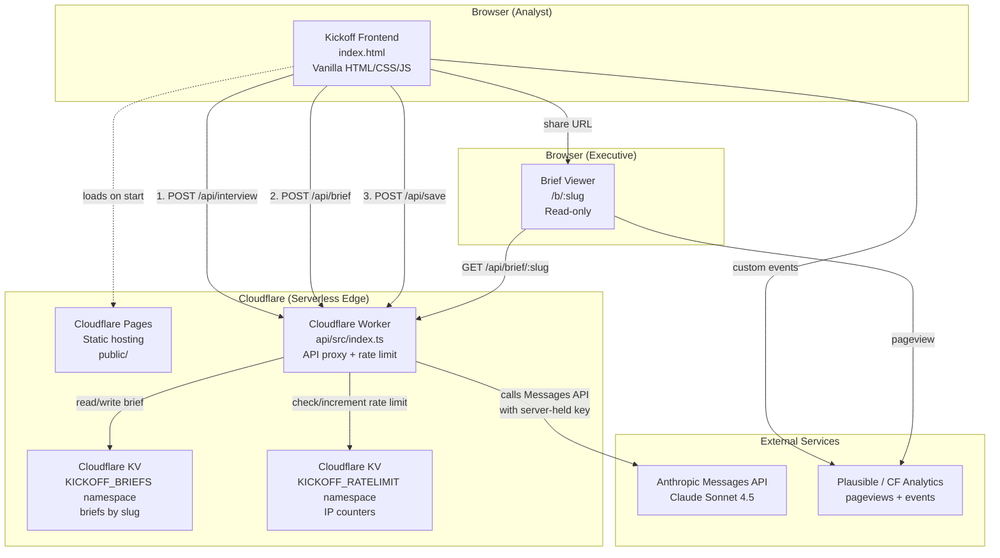
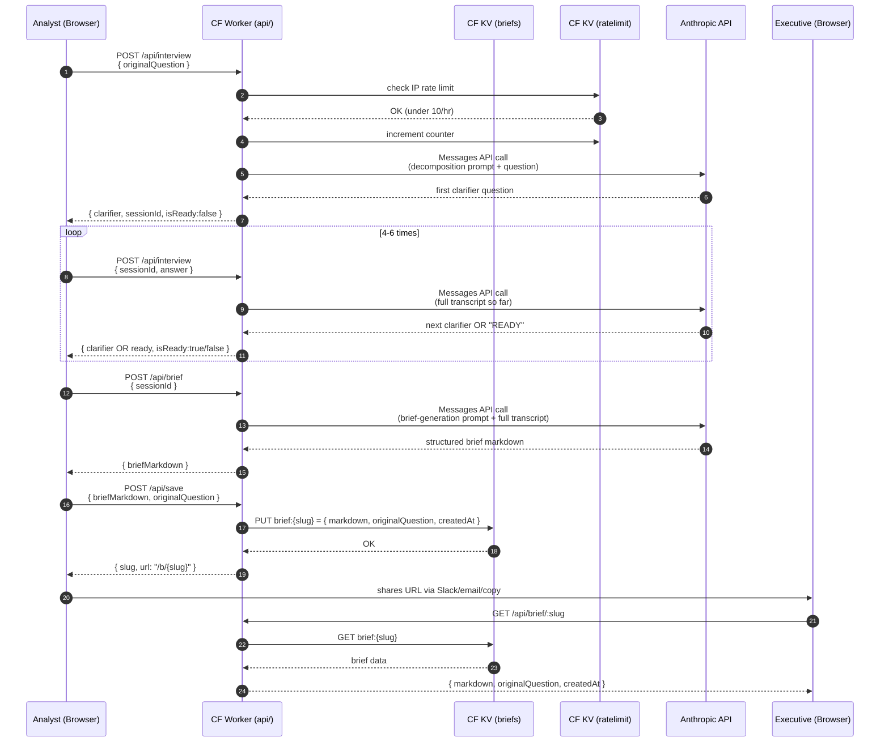

# Kickoff — System Architecture

**Version:** 1.0
**Date:** Day 52 (of 60) · Capstone Day 2
**Owner:** Garvit Mittal
**Status:** Approved

> This document is the single technical source of truth for Kickoff v1.0. It supersedes any prior architectural sketches. If any decision here conflicts with the PRD or Implementation Blueprint, the conflict is flagged in §7.

---

## 1. Tech Stack (Final)

| Layer | Choice | Why |
|---|---|---|
| **Frontend** | Single-file HTML + vanilla CSS + vanilla JavaScript | Consistent with 50 prior single-file HTML builds in this challenge. Zero framework overhead. Ships as one file. No build step. |
| **Backend** | Cloudflare Workers (serverless) | Free tier covers expected launch scale (100k requests/day). Global edge deployment. Sub-50ms cold start. Written in TypeScript. |
| **Database** | Cloudflare KV (key-value store) | Free tier: 100k reads/day, 1k writes/day — sufficient for 50-100 briefs/day at launch. Native to Workers, zero setup, sub-10ms reads. No SQL needed for our access patterns. |
| **Authentication** | **None** in v1.0 | Explicit non-goal per PRD §9.2. No accounts, no signup, no login. IP-based rate limiting is the only gate. |
| **AI Model / API** | Anthropic Messages API — Claude Sonnet 4.5 | Best-in-class reasoning for question decomposition. API key held server-side in Worker environment (never exposed to browser). |
| **Static Hosting** | Cloudflare Pages | Same platform as Workers. Free tier is unlimited bandwidth. Auto-deploys on `git push`. Custom domain support built-in. |
| **Analytics** | Plausible free tier OR Cloudflare Web Analytics | Privacy-respecting. No cookies. Custom event support for `brief_created` and `brief_shared`. |
| **Domain** | To be purchased Day 52 evening — `kickoff.app` / `trykickoff.com` / `getkickoff.com` (first available) | Custom domain for credibility. Purchase via Cloudflare Registrar (free WHOIS privacy, at-cost pricing). |
| **Version Control** | GitHub — `garvit-mittal04/kickoff` | Public repo, MIT license. Enables raw.githack sharing during development. |

**Cost target:** Total infrastructure cost under $20/month at launch scale. Cloudflare stack is $0 for expected traffic. Domain is ~$10/year.

---

## 2. Component Diagram

---

## 3. Data Flow — End-to-End Brief Creation

---

## 4. Request Lifecycle Detail

### 4.1 POST /api/interview (adaptive Q&A)

1. Frontend sends POST with either `{ originalQuestion }` (first turn) or `{ sessionId, answer }` (subsequent turns).
2. Worker validates payload shape (400 on malformed).
3. Worker checks IP rate limit via `KICKOFF_RATELIMIT` KV. If >10 requests in the last hour, returns 429.
4. Worker increments the rate limit counter with a 1-hour TTL.
5. Worker constructs the full conversation transcript for the session (stored in `KICKOFF_SESSIONS` KV with 1-hour TTL).
6. Worker calls Anthropic Messages API with the decomposition system prompt + the transcript.
7. Worker parses the response — expects either a next-question string or the literal token `READY:` followed by nothing (signals end of clarifier phase).
8. Worker returns JSON: `{ clarifier?: string, sessionId: string, isReady: boolean }`.
9. Latency budget: <5 seconds per turn (Anthropic streaming not used in v1.0 for simplicity).

### 4.2 POST /api/brief (final brief generation)

1. Frontend sends POST with `{ sessionId }` once the interview is READY.
2. Worker retrieves the full transcript from `KICKOFF_SESSIONS` KV.
3. Worker calls Anthropic Messages API with the brief-generation prompt + full transcript.
4. Worker returns JSON: `{ briefMarkdown: string }`.
5. Latency budget: <15 seconds (larger prompt, more output tokens).

### 4.3 POST /api/save (persist a brief)

1. Frontend sends POST with `{ briefMarkdown, originalQuestion }`.
2. Worker generates an 8-character URL-safe slug using `crypto.randomUUID().slice(0,8)`.
3. Worker checks slug collision in `KICKOFF_BRIEFS` KV (retries up to 3 times if collision — statistically negligible).
4. Worker writes `{ markdown, originalQuestion, createdAt }` to `KICKOFF_BRIEFS` KV under key `brief:{slug}`. No TTL — permanent.
5. Worker returns JSON: `{ slug, url: "/b/{slug}" }`.

### 4.4 GET /api/brief/:slug (retrieve a brief for permalink view)

1. Any user (analyst or executive) requests the brief by slug.
2. Worker reads `brief:{slug}` from `KICKOFF_BRIEFS` KV.
3. If not found, returns 404.
4. If found, returns JSON: `{ markdown, originalQuestion, createdAt }`.
5. No rate limit on reads (public permalinks must be shareable at scale).

---

## 5. AI Interaction Detail

Two hand-tuned prompts, both stored in `design/prompts.md` and embedded in the Worker as constants.

### 5.1 Decomposition Prompt (drives the interview)

**Role:** Senior analyst interviewer helping a junior analyst scope an ambiguous exec question.
**Objective:** Ask ONE clarifying question at a time to decompose the ask. After 4-6 clarifiers, emit `READY:` to signal enough context.
**Constraints:** One question per turn. No preamble. Never re-ask a question already answered. Never assume unstated context.
**Reasoning:** Prefer questions about baseline, time window, segment, and success criteria over questions about tooling.
**Output format:** Either a single question (plain string) OR the literal token `READY:` alone.

### 5.2 Brief Generation Prompt (produces the structured output)

**Role:** Senior analyst producing a scoping brief that will be shared with an executive for approval.
**Objective:** Convert the full interview transcript into a structured brief with these H2 sections:
- The Question (restated in plain English)
- Sub-questions (3-6, ranked by likely impact)
- Hypotheses (2-3 per sub-question)
- Data sources (per sub-question — specific tables / systems / metrics)
- Analysis approach (per sub-question — the technique to use)
- Executive summary template (empty framework for the eventual writeup)
- Definition of done (what the exec approves against)
- Estimated effort (hours range)

**Constraints:** Markdown only. No JSON. Never invent data sources not implied in the transcript. If the transcript is thin, produce a shorter brief and flag missing context.
**Quality checks:** Every sub-question must be answerable with the data sources listed. Effort estimate must be defensible.

---

## 6. External Services

| Service | Purpose | Access | Cost |
|---|---|---|---|
| **Anthropic Messages API** | Question decomposition + brief generation | Server-side only (API key in Worker env var) | Pay-per-token. Budgeted ~$0.05 per brief. $50 pre-approved cap for launch. |
| **Cloudflare Pages** | Static frontend hosting | Public web | Free (unlimited bandwidth) |
| **Cloudflare Workers** | API proxy + business logic | Public web (rate-limited) | Free (100k requests/day) |
| **Cloudflare KV** | Brief storage + rate limit counters | Server-side (via Worker) | Free (100k reads / 1k writes daily) |
| **Cloudflare Registrar** | Domain purchase + DNS | User-managed | ~$10/year (at-cost) |
| **Plausible / CF Web Analytics** | Pageviews + custom events | Client-side script | Free (Plausible free trial or CF Analytics free tier) |
| **GitHub** | Version control + issue tracking | Public repo | Free |

---

## 7. Deviations from PRD / Implementation Blueprint

Two minor refinements from yesterday's docs. Both are compatible improvements — no scope creep.

### 7.1 Session storage

**Original plan:** Store interview state client-side (in the browser) and send full transcript on each turn.
**Refined plan:** Store interview state server-side in `KICKOFF_SESSIONS` KV with 1-hour TTL, referenced by `sessionId`.
**Why:** Reduces payload size on each request. Enables potential future features (resume interview, view session history) without frontend refactor. Free-tier writes cover expected usage (~2-3 writes per completed brief = 200 writes/day at launch scale, well under 1k limit).

### 7.2 Brief slug format

**Original plan:** `crypto.randomUUID()` (36-char UUIDs).
**Refined plan:** First 8 characters of `crypto.randomUUID()` — URL-friendly short slugs.
**Why:** Shorter permalinks share better. Collision probability at 50 briefs is <1 in a billion. Retry-on-collision logic (up to 3 tries) handles the vanishingly rare case.

---

## 8. Non-Goals (Reaffirmed from PRD §9.2)

Everything in this list is explicitly OUT of scope for v1.0. If a feature request lands during the build, it goes in `docs/v2-parking-lot.md`, not the v1.0 backlog.

- User accounts, signup, login
- Brief editing after creation (immutable)
- Comments / collaboration on shared briefs
- Templates library
- Data source connectors (Salesforce, Snowflake, etc.)
- Slack app / bot / slash command
- Team / workspace features
- Any paid tier or monetization
- Mobile-optimized UI (functional but desktop-first)
- Multi-language support

---

## 9. Success Criteria (Reaffirmed from PRD §8.1)

By Day 60:
- **50+ briefs created** by real analysts on real questions
- **10+ briefs publicly shared** (permalinks in comments, forwarded to execs, linked externally)
- **5+ named testimonials** from real analysts

---

*End of ARCHITECTURE.md v1.0 — Day 52 of 60*
