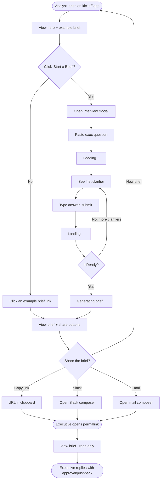

# Kickoff — UI & User Flow

**Version:** 1.0
**Date:** Day 52 · Capstone Day 2
**Fidelity:** Low-fi wireframes (ASCII + Mermaid). High-fi implementation happens Days 54-57.

---

## 1. User flow diagram



---

## 2. Screen inventory

Every screen exists for a reason. v1.0 has exactly four:

| # | Screen | Purpose | Who sees it |
|---|---|---|---|
| S-01 | **Landing** | Explain the product, show an example, drive to "Start a Brief" CTA | Cold visitor, returning analyst |
| S-02 | **Interview Modal** | Adaptive Q&A — one question at a time | Analyst mid-brief |
| S-03 | **Brief View + Share** | Show the completed brief, offer share buttons | Analyst who just finished |
| S-04 | **Permalink Brief Viewer** | Read-only view of a saved brief at `/b/:slug` | Anyone with the link (usually the exec) |

That's it. No settings, no dashboard, no account page. No screen exists without a reason.

---

## 3. Wireframes (low-fi ASCII)

### S-01 — Landing page

```
┌────────────────────────────────────────────────────────────────────┐
│  [Kickoff logo]                              [About]  [GitHub]     │
├────────────────────────────────────────────────────────────────────┤
│                                                                    │
│                                                                    │
│           K I C K O F F                                            │
│                                                                    │
│           The analysis brief you write                             │
│           before you write any SQL.                                │
│                                                                    │
│           [    Start a Brief  →   ]                                │
│                                                                    │
│           See an example brief ↓                                   │
│                                                                    │
├────────────────────────────────────────────────────────────────────┤
│  How it works                                                      │
│  ┌────────────┐  ┌────────────┐  ┌────────────┐                    │
│  │ 01         │  │ 02         │  │ 03         │                    │
│  │ Paste the  │  │ Answer 4-6 │  │ Get a      │                    │
│  │ vague ask  │  │ clarifiers │  │ shareable  │                    │
│  │            │  │            │  │ brief      │                    │
│  └────────────┘  └────────────┘  └────────────┘                    │
├────────────────────────────────────────────────────────────────────┤
│  Live examples                                                     │
│  ┌────────────────────────────────────────────────┐                │
│  │ "Why is program retention down this quarter?"  │ → open brief   │
│  ├────────────────────────────────────────────────┤                │
│  │ "Why did Q3 revenue miss the forecast?"        │ → open brief   │
│  ├────────────────────────────────────────────────┤                │
│  │ "Should we launch feature X next month?"       │ → open brief   │
│  └────────────────────────────────────────────────┘                │
├────────────────────────────────────────────────────────────────────┤
│  FAQ                                                               │
│  › What is this?                                                   │
│  › Who is it for?                                                  │
│  › Is it free?                                                     │
│  › Do you store my data?                                           │
│  › Can I use it for team briefs?                                   │
├────────────────────────────────────────────────────────────────────┤
│  Built with Claude · #60DayClaudeChallenge · by Garvit Mittal      │
└────────────────────────────────────────────────────────────────────┘
```

### S-02 — Interview modal

```
┌────────────────────────────────────────────────────────────────────┐
│                                                              [ X ] │
│  Kickoff · New brief                                               │
├────────────────────────────────────────────────────────────────────┤
│                                                                    │
│  Question 3 of ~5                                                  │
│                                                                    │
│  ┌──────────────────────────────────────────────────────────────┐  │
│  │                                                              │  │
│  │  Which participant segments matter most for this analysis?   │  │
│  │  (e.g., by age group, program type, referral source)         │  │
│  │                                                              │  │
│  └──────────────────────────────────────────────────────────────┘  │
│                                                                    │
│  ┌──────────────────────────────────────────────────────────────┐  │
│  │                                                              │  │
│  │  Your answer...                                              │  │
│  │                                                              │  │
│  │                                                              │  │
│  └──────────────────────────────────────────────────────────────┘  │
│                                                                    │
│  [ Skip ]                                     [ Answer → ]         │
│                                                                    │
│  ────────                                                          │
│  Progress: ●●●○○  (3 of ~5)                                        │
└────────────────────────────────────────────────────────────────────┘
```

**States within S-02:**
- **First turn:** the textarea placeholder is "Paste the exec question..." (no clarifier shown yet)
- **Loading:** submit button becomes a spinner; textarea disabled
- **Ready:** clarifier area shows "Interview complete → generating brief..." with a spinner

### S-03 — Brief view + share (after generation)

```
┌────────────────────────────────────────────────────────────────────┐
│                                                              [ X ] │
│  Kickoff · Brief created                                           │
├────────────────────────────────────────────────────────────────────┤
│                                                                    │
│  Your brief is ready.                                              │
│                                                                    │
│  ┌──────────────────────────────────────────────────────────────┐  │
│  │  kickoff.app/b/a1b2c3d4              [ 📋 Copy ]  [ ✎ ]      │  │
│  └──────────────────────────────────────────────────────────────┘  │
│                                                                    │
│  [ Copy link ]  [ Share to Slack ]  [ Share to email ]             │
│                                                                    │
│  ────────                                                          │
│                                                                    │
│  ## The Question                                                   │
│  Investigate the drivers of the drop in Fall 2024 cohort           │
│  retention, quantify the drop, and identify which participant      │
│  segments are most affected.                                       │
│                                                                    │
│  ## Sub-questions                                                  │
│  1. How much has retention actually dropped? (Baseline + magnitude)│
│  2. When did the drop start? (Weekly cohort view)                  │
│  3. Which participant segments are driving it?                     │
│  4. What changed operationally in that window?                     │
│  5. Is the drop statistically significant?                         │
│                                                                    │
│  ## Ranked hypotheses                                              │
│  ...                                                               │
│                                                                    │
│  ────────                                                          │
│  [ + Start a new brief ]                                           │
└────────────────────────────────────────────────────────────────────┘
```

### S-04 — Permalink brief viewer (read-only)

```
┌────────────────────────────────────────────────────────────────────┐
│  [Kickoff logo]                                                    │
├────────────────────────────────────────────────────────────────────┤
│                                                                    │
│  Shared brief · Created July 21, 2026                              │
│                                                                    │
│  ┌──────────────────────────────────────────────────────────────┐  │
│  │  Original question:                                          │  │
│  │  "Why is program retention down this quarter?"               │  │
│  └──────────────────────────────────────────────────────────────┘  │
│                                                                    │
│  ## The Question                                                   │
│  Investigate the drivers of the drop in Fall 2024 cohort           │
│  retention...                                                      │
│                                                                    │
│  ## Sub-questions                                                  │
│  ...                                                               │
│                                                                    │
│  ────────                                                          │
│                                                                    │
│  [ + Create your own brief ]  [ Copy this link ]                   │
│                                                                    │
├────────────────────────────────────────────────────────────────────┤
│  Made with Kickoff · kickoff.app                                   │
└────────────────────────────────────────────────────────────────────┘
```

---

## 4. Navigation

**Simple:** the entire app is a single HTML page with client-side view swaps.

| From | To | Trigger |
|---|---|---|
| Landing (S-01) | Interview modal (S-02) | Click "Start a Brief" CTA |
| Landing (S-01) | Permalink viewer (S-04) | Click an example brief link |
| Interview modal (S-02) | Brief view (S-03) | Interview completes + brief generates |
| Interview modal (S-02) | Landing (S-01) | Click X close |
| Brief view (S-03) | Landing (S-01) | Click "+ Start a new brief" or X close |
| Permalink viewer (S-04) | Landing (S-01) | Click Kickoff logo or "+ Create your own brief" |
| Any screen | Permalink viewer (S-04) | URL is `/b/:slug` on load |

No backend routing needed for S-01 through S-03 — they're states within the same page. Only `/b/:slug` uses a URL pattern (served by Cloudflare Pages with a `_redirects` rewrite to `index.html`, which reads the slug from `window.location.pathname` on load).

---

## 5. Empty states

| Screen | Empty state |
|---|---|
| S-01 | N/A (landing always shows the hero + example briefs) |
| S-02 | First turn has placeholder text: "Paste the exec question exactly as it arrived. Don't rewrite it — that's the tool's job." |
| S-03 | N/A (only shown after brief generation) |
| S-04 | If slug not found: "This brief doesn't exist or was removed. → Create your own brief." |

---

## 6. Error states

| Error | UX |
|---|---|
| Rate limit hit (429) | Modal shows: "You've created 10 briefs in the last hour. Try again in <N> minutes, or drop me a note if this is real usage." |
| API 500 / network error | Modal shows: "Something went wrong. Retry?" with a Retry button. Preserves the user's input so they don't lose progress. |
| Session expired (404) | Modal shows: "This interview session expired (1-hour limit). Start over?" with a "Start over" button. |
| Empty question submitted | Inline error under textarea: "Paste the exec question to start." |
| Question too long (>2000 chars) | Inline: "Keep it under 2,000 characters — the interview will fill in the details." |

---

## 7. Accessibility

- All interactive elements are keyboard-navigable (tab / shift+tab).
- Modals trap focus while open and return focus on close.
- Every button has a visible focus ring (`:focus-visible`).
- Color contrast ratio ≥ 4.5:1 for all text against background.
- `<textarea>` has a visible label (`Your answer` or `Exec question`).
- Loading states use `aria-live="polite"` announcements.
- No autoplay animations; `prefers-reduced-motion: reduce` disables all transitions.

---

## 8. Responsive design

- **Desktop first** (as declared in PRD §7). Optimized for ≥ 1024px width.
- **Mobile:** functional but not the priority. Modal fills the viewport. Buttons stack vertically. Font scales down slightly.
- Breakpoints: `≥ 1024px` (desktop), `768-1023px` (tablet), `< 768px` (mobile).

---

## 9. Not in v1.0

No dashboard. No settings page. No user profile. No history / list of past briefs. No brief editor. No comments UI. No login / signup screens.

If any of these show up as feedback during beta, they go into `docs/v2-parking-lot.md`.

---

*End of UI-WIREFRAMES.md v1.0 — Day 52 of 60*
